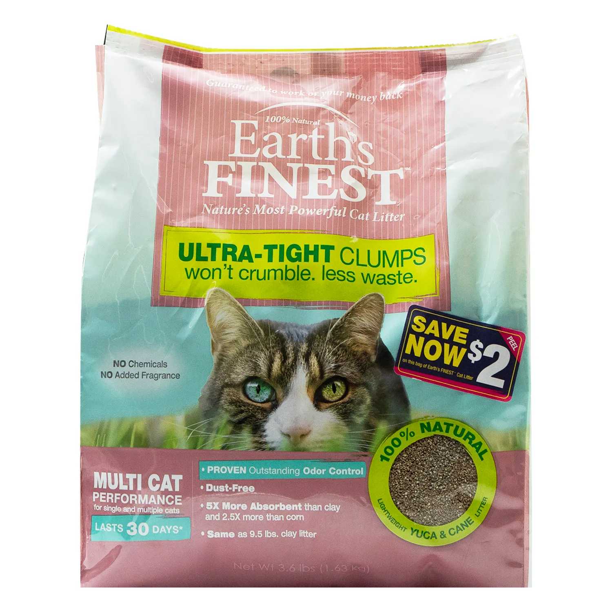

# **GeoPetxico**

¡Bienvenido a **GoePetxito**! Todo en mascotas exoticas :)

***

## [Mamiferos](https://es.wikipedia.org/wiki/Mammalia)

### Erizos

### Lemures 

***

## [Anfibios](https://es.wikipedia.org/wiki/Amphibia)

### Salamandras 

### Sapos

***

## [Reptiles](https://es.wikipedia.org/wiki/Reptilia)

### Iguanas

### Camaleones

***

## [Artropodos](https://es.wikipedia.org/wiki/Arthropoda)

### Arañas

### Cienpies

***

## [Aves](https://es.wikipedia.org/wiki/Aves)

***

## ***Accesorios***

***

#### Arena

***

#### Camas

#### Juguetes

#### Alimento